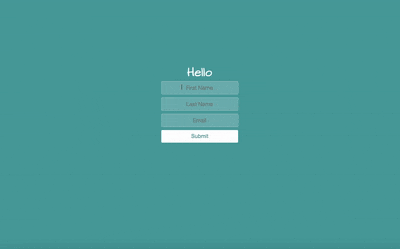

<h1 align="center">React-Registration-Login Form</h1>
 


<h2 align="center">User Info</h2>
 
 
  <p align="center">
<h3>With This React Application<h3>
    I Wanted to see how I could design a registration Login Form using React. I utilized React hooks and controlled components to put it together. React useState is used in order to read the current value of first name, lastname and email that would be saved to state.Then come the functions setContact, handleChange. These are used to save a new state of two variables, name and contact. After the new state is saved, our react component gets re-rendered.
  </p>
  
  

- - - - - - - - -


   <p align="center">
<h3>I Incorporated state change listeners</h3>
    to firstname and lastname fields and their new state is saved using the respective setContact function. This type of form component is called a controlled component.
    On click of submit button, validate function is called. This function checks if values of first name and lastname are valid or not.
    After performed validation function returns true, handleChange will be triggered. Rendered on the screen in an h1 as text while the user types their entery. Although event handlers and onclick appear to be rendered inline, they will be collected and implemented using event delegation.
   </p> 


    Here's A Brief Look @ The Application(Gif of React Reg Login Form).
    
   
   
    

    
    
    
    
    
    


    Building Encapsulated Components That 
    
    
    Manage Their Own State, Then Composing 
    
    
    Them To Make Complex UIs.
   

    


 check out a live demo of the project here react-registration-login-form.surge.sh
<h2 align="center">Features</h2>


<p align="center">
-[Material-UI]

<p align="center">
-[Babel/core]

<p align="center">
-[Reactjs -16]

<p align="center">
-[Webpack -4]


- - - - - - - - -

<p align="center">
  
<h2 align="center">Recommended Tools</h2>


The following tools are recommended for a React project. Also you will find included below some links for building some complex UI animations and conversion of SVG image into Data URL with the help of Webpack loader.
   
- [Material-UI](https://material-ui.com) UI and components library.
- [ESLint-loader](https://webpack.js.org/loaders/eslint-loader), When using with transpiling loaders(like babel-loader),make sure they are in correct order(bottom to top). Otherwise files will be checked after being processed by babel-loader.
- [CSS-Tricks](https://css-tricks.com/building-a-complex-ui-animation-in-react-simply), For building complex UI animations in React.
- [Webpack CSS-loaders](https://webpack.js.org/loaders/css-loader/) interprets @import and url() like import/require() and will resolve them.
- [SVG-React-Webpack](https://www.pluralsightcomguides-how-to-load-svg-with-react-and-webpack) To utilize  an SVG image in your React project, it will have to be transformed into a Data URL. We will need an  appropriate webpack loader in our bundler. 
</p>


<h2>Installation</h2>


   ```sh
   git clone https://github.com/FernandoNunez-Dev/React-Reg-Login-Form
   ```

   ```sh
   cd React-Reg-Login-Form
   ```

   ```sh
   npm install
   ```

   ```sh
   npm start
   ```
Runs the app in the development mode.<br />
Open [http://localhost:3000](http://localhost:3000) to view it in the browser.

The page will reload if you make edits.<br />
You will also see any lint errors in the console.


   ```sh
   npm run build
   ```
Builds the app for production to the `build` folder.<br />
It correctly bundles React in production mode and optimizes the build for the best performance.

The build is minified and the filenames include the hashes.<br />
Your app is ready to be deployed!
   
   
 
- _Software Utilized_
  
  - [Reactjs -16](https://reactjs.org)
  - [Babel/core](https://www.npmjs.com/package/@babel/core)
  - [Webpack -4](https://webpack.js.org)
  - [Material-UI](https://material-ui.com)
  - [Nodejs -LTS](https://nodejs.org/en)
  - [ESLint-loader](https://webpack.js.org/loaders/eslint-loader)
  - [CSS-Tricks](https://css-tricks.com/building-a-complex-ui-animation-in-react-simply)
  - [Webpack CSS-loaders](https://webpack.js.org/loaders/css-loader/)
  - [SVG-React-Webpack](https://www.pluralsightcomguides-how-to-load-svg-with-react-and-webpack)


